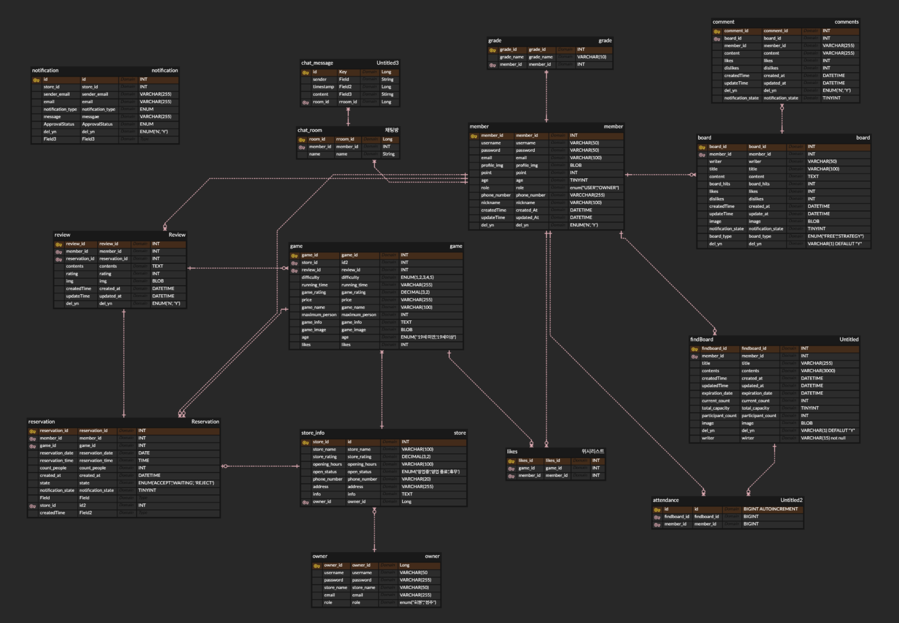

# NoExit

방탈출게임을 사랑하는 찐덕후들을 위한 통합 플랫폼 서비스

 

## 🙋🏻팀원

| **김민성** | **김민지** | **박수현** | **이명규** |
| :------: |  :------: | :------: | :------: |
| [   @Windowmincastle](https://github.com/Windowmincastle) | [   @epiuwiruiw](https://github.com/epiuwiruiw) | [   @34suuuuu](https://github.com/34suuuuu) | [   @leem5514](https://github.com/leem5514) |

 

## 💡 프로젝트 개요
  

"다양한 선택지와 편리한 예약 기능을 하나의 플랫폼에서"

NoExit은 전국의 방탈출 게임을 한눈에 검색, 예약, 리뷰 확인, 커뮤니티 참여, 그리고 참가 인원 모집까지 가능한 통합 플랫폼 서비스입니다.
방탈출 게임을 사랑하는 유저들에게 편리한 서비스를 제공하며 방탈출 카페 업주들에게는 효율적인 마케팅과 고객 관리 도구를 제공합니다. 

NoExit은 참가 인원을 모집하고 함께 방탈출을 해결해 나갈 수 있는 커뮤니티 기능을 핵심 차별점으로 두었습니다.
유저들이 손쉽게 참여 인원을 모집하여 혼자서도 부담 없이 방탈출 게임을 즐길 수 있도록 하였고, 모집된 인원을 채팅방에 초대하여 활발한 소통과 커뮤니티 활동이 가능하다는 것이 NoExit만의 강점입니다.

 

## 🛠 기술 스택

### Back-end

### Front-end

### Devops

###  DB

### Tools

 

	

## 🗓️ WBS

	

  

[🗓️ WBS 상세 보기](https://docs.google.com/spreadsheets/d/1VdXKl6pfghy9OK6zTpShCHeG1uyAGB85Y2ycm1viF5g/edit?usp=sharing)

 

	

## 📝 요구사항정의서

	
  

[📝 요구사항 명세서 상세보기](https://docs.google.com/spreadsheets/d/1VdXKl6pfghy9OK6zTpShCHeG1uyAGB85Y2ycm1viF5g/edit?gid=566809607#gid=566809607)

 

	

## 📋 ERD

	

 

	

 

## 📌 주요 기능    
  ### 참여 게시판
  - 방탈출 게임 매니아들이 원하는 게임, 시간, 인원을 선택하여 모집할 수 있습니다.
  - 모집 인원이 마감되면 자동으로 채팅방을 생성하여 초대 메시지를 전송합니다.
  - 초대 메시지를 통해 참여 인원들은 채팅방에 바로 참여 가능합니다.

  ### 실시간 예약
  - 사용자가 예약을 요청하면 점주는 예약 요청에 대한 알림을 받을 수 있습니다.
  - 점주의 예약 승인/거절 여부에 대해서 사용자는 알림을 받을 수 있습니다.
    
  ### 채팅을 통한 커뮤니티 및 참여 활성화
  - 참여 게시판(Escape With Me)으로 생성된 채팅방에서 실시간 채팅이 가능합니다.
    
  ### 실시간 알림 
  - 게시글에 댓글 작성 혹은 해당 게시글을 추천 시 작성자에게 실시간 알림이 전송됩니다.
  - 예약 현황 업데이트 시 알림이 전송됩니다. 

  ### 정교한 검색 기능
  - 게임을 카테고리별, 금액별, 난이도별로 검색할 수 있습니다.

 

## ✨ 기능 테스트 및 시연

  

회원가입 & 로그인

#### 회원가입 & 로그인

  

알림

#### 실시간 알림 & 알림 목록 조회

  

실시간 채팅

#### 실시간 채팅

  

예약 및 리뷰 작성

#### 예약 요청 ,(점주)예약 거절 및 승인

#### 리뷰 작성 , 조회 , 수정 , 삭제

  

Escape With me

#### 모집글 조회, 작성, 수정, 삭제 기능 

#### 모집글 검색 기능 

#### 모집글 참여, 뱃지, 채팅방 생성 

#### 모집글 페이징, 참여하기 

  

게시판

#### 게시판 글 작성 

#### 게시판 글 수정 및 삭제 

#### 게시판 글 검색(제목, 카테고리, 내용) 

#### 게시판 글 추천/비추천 

#### 댓글 작성 및 수정

#### 댓글 추천/비추천 

  

위시리스트

#### 위시리스트 생성 

#### 위시리스트 삭제

#### 마이페이지 위시리스트

